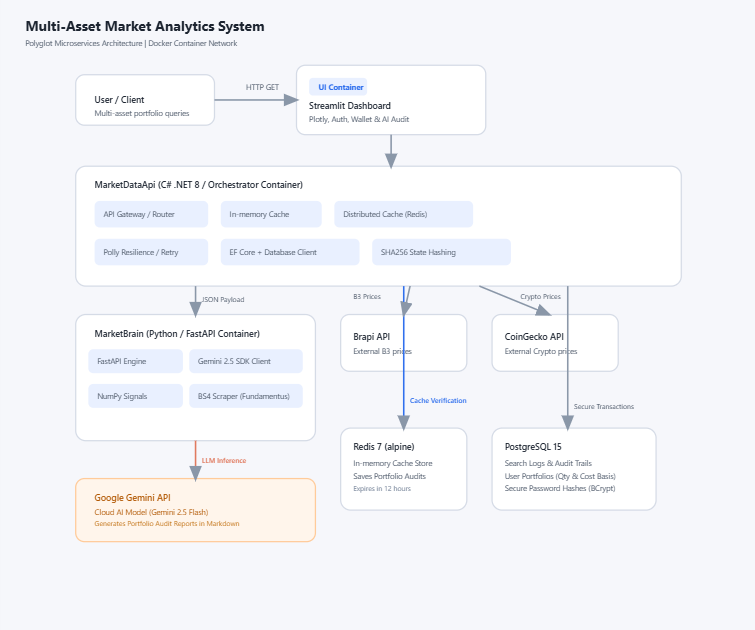

# 📊 Multi-Asset Market Analytics System

A production-style, polyglot microservices system to **fetch, persist, and analyze** both **Cryptocurrencies** and **B3 Stocks/REITs** in near real-time, featuring secure **User Portfolios (Wallets)**, a **Distributed Caching Layer (Redis)**, and a **Generative AI Portfolio Assistant (Gemini 2.5)**.

## 🧭 Overview

This project follows strict **Separation of Concerns** by splitting transactional workloads (C#) from analytical processing, scraping, and AI generation (Python). The entire ecosystem is containerized, utilizing internal network routing, distributed caching, and an API Gateway pattern to keep ingestion, intelligence, and persistence cleanly isolated.

## 🧩 Architecture Diagram



1. **Orchestrator & API Gateway (C# / ASP.NET Core 8)**
   - Acts as the single entry point, routing requests using the Factory Pattern (`IMarketDataService`).
   - Handles real-time data ingestion (CoinGecko for crypto, Brapi for B3).
   - **Distributed AI Caching:** Orchestrates portfolio caching using **Redis** and .NET's `IDistributedCache` interface. It generates a cryptographic **SHA-256 state signature** of the user's portfolio. If the portfolio state hasn't changed, it bypasses the downstream Python/AI call completely, returning the cached analysis in milliseconds with zero token costs.
   - **Tolerant Reader Proxy:** Proxies fundamental data requests securely to the internal Python engine.
   - **Secure Authentication:** Manages user registration and sign-in using `BCrypt.Net-Next` to securely salt and hash passwords.
   - **Portfolio Management:** Orchestrates user assets, automatically calculating the **Weighted Average Price** (Cost Basis) on subsequent purchases.
   - In-memory caching (up to 10 minutes for B3 fundamentals) and distributed caching (up to 12 hours for AI audits).
   - Resilient HTTP clients configured with **Polly** retries.

2. **Analytical Brain & AI Engine (Python / FastAPI)**
   - Mathematical analysis, B3 scraping, and LLM orchestration, completely isolated from the outside world.
   - **AI Portfolio Assistant:** Integrates the state-of-the-art **Google Gemini 2.5 Flash** model via the official Python SDK. It consumes the structured portfolio payload from the C# gateway and generates a detailed financial audit report covering asset allocation, risk concentration, and rebalancing recommendations.
   - **Fundamentals Scraper:** Pulls B3 metrics from Fundamentus and normalizes Brazilian financial formats handling Unicode/Encoding issues.
   - **FII Classification:** Categorizes FIIs as `tijolo` (brick), `papel` (paper), or `fof` (fund of funds) using label analysis and text matching.
   - **Trading Signals:** Computes trend, percentage change, and volatility using NumPy.

3. **Data Visualization (Python / Streamlit)**
   - **Interactive User Authentication:** Login and signup forms right in the sidebar to secure personalized dashboards.
   - **Dynamic Portfolio Dashboard (The Wallet):** Fetches the user's active holdings, calculating real-time portfolio value and total profit/loss (P&L %) using live market prices.
   - **AI Assistant UI:** Features a container-wide button to trigger the **Gemini 2.5 Portfolio Audit** asynchronously, rendering rich Markdown reports natively.
   - **Asset Segregation:** Displays assets cleanly divided into **Stocks & REITs** (BRL) and **Cryptocurrencies** (USD) tables.
   - **Asset Allocation Chart:** Renders an interactive Plotly Donut Chart representing current market allocation.
   - **Context-Aware Sidebar:** Dynamically toggles forms to ensure a clean, modern user experience.
   - **Dynamic Fallback Logic:** Automatically falls back from FII to Stock on ambiguous tickers.

4. **Infrastructure & Persistence Layer (Docker, PostgreSQL & Redis)**
   - The entire stack is orchestrated via `docker-compose` within a private Docker Network containing 5 services: `db-1`, `api-1`, `brain-1`, `dashboard-1`, and `cache-1`.
   - **Distributed Key-Value Store (Redis 7):** Persists serialized JSON bytes of AI analysis reports mapped to portfolio hashes.
   - **Relational DB (PostgreSQL 15):** Stores search logs, secure user credentials, and active portfolios using Entity Framework Core (Code-First approach).
   - **Race Condition Prevention:** Healthchecks ensure the C# API waits for PostgreSQL to be healthy before applying database migrations on startup.

## 🧰 Tech Stack

- **Transactional Backend:** C# .NET 8, ASP.NET Core Minimal APIs, Polly, BCrypt.Net-Next, Microsoft.Extensions.Caching.StackExchangeRedis
- **Analytical/AI/Scraping:** Python 3.11, FastAPI, Pydantic, NumPy, BeautifulSoup4, google-generativeai (Gemini 2.5 SDK)
- **Caching Layer:** Redis 7 (alpine)
- **Database:** PostgreSQL 15
- **ORM:** Entity Framework Core
- **Infrastructure / DevOps:** Docker, Docker Compose, Multi-stage Builds, Healthchecks, Output Buffering Tuning
- **Frontend:** Streamlit, Pandas, Plotly Express
- **Quality Assurance:** xUnit, Moq, Moq.Protected (TDD Methodology)

## ⚙️ Configuration

Before running the app, configure your environment variables:

1. Create a `.env` file in the root directory (where the `docker-compose.yml` is located) and add your credentials:
```env
POSTGRES_USER=postgres
POSTGRES_PASSWORD=your_password
POSTGRES_DB=multiassetdb
BRAPI_API_KEY=your_brapi_api_key
GEMINI_API_KEY=your_google_ai_studio_gemini_key
``` 
> 🔒 Security note: Keep .env and appsettings.json files out of source control. Never commit production secrets.

## ▶️ How to Run
Thanks to full containerization, spinning up the entire ecosystem takes only a single command.

```bash
docker-compose up -d --build
```
Wait a few seconds for the database to become healthy and the C# API to run its migrations. Then, access the application:

- **Streamlit Dashboard:** 
```bash
http://localhost:8501
```

- **C# Swagger (API Gateway):** 
```bash
http://localhost:5091/swagger
```

## 🔌 API Endpoints (Gateway)
All requests should be routed through the C# API Gateway (Port 5091):

- **User Registration:** (POST) 
```bash
http://localhost:5091/users/register
```

- **User Login:** (POST) 
```bash
http://localhost:5091/users/login
```

- **Add to Portfolio:** (POST) 
```bash
http://localhost:5091/portfolios/add
```

- **Get Portfolio:** (GET) 
```bash
http://localhost:5091/portfolios/{userId}
```

- **AI Portfolio Analysis:** (POST) 
```bash
http://localhost:5091/portfolios/{userId}/analyze-ai
```
- **Crypto Price/History:** (GET) 
```bash
http://localhost:5091/price/crypto/bitcoin/history
```
- **Stock Price/History:** (GET) 
```bash
http://localhost:5091/price/stock/petr4/history
```
- **Stock Fundamentals:** (GET) 
```bash
http://localhost:5091/fundamentals/stock/petr4
```
- **FII Fundamentals:** (GET) 
```bash
http://localhost:5091/fundamentals/fii/mxrf11
```
- **Audit Logs:** (GET)
```bash
http://localhost:5091/logs
```

## 🧪 Test-Driven Development (TDD)
This project strictly applies the TDD methodology to ensure service stability. You can execute the test suite (12 comprehensive unit and integration tests) to validate compilation, serialization, and mocking handlers:

### Navigate to the test directory and run
```bash
dotnet test
``` 

**Our testing layer includes:**

- MockHttpMessageHandler & Moq.Protected: For simulating internal network routes without spinning up containers.
- IDistributedCache Mocks: For validating that our C# caching logic successfully intercepts downstream HTTP traffic on Redis hits (Cache Hit tests).

## 📜 License
This project is distributed under the MIT License. See [LICENSE](LICENSE) for details.